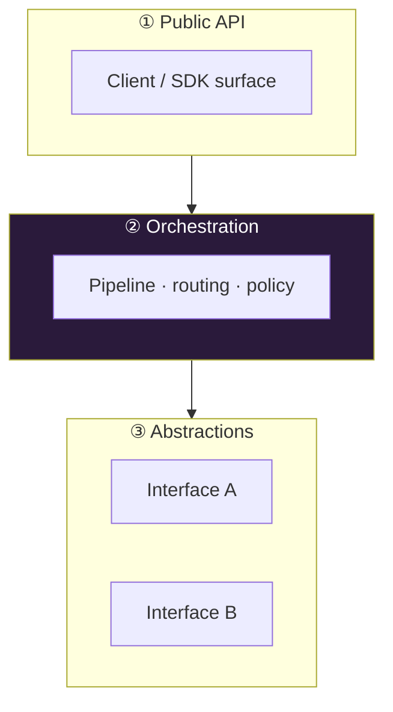
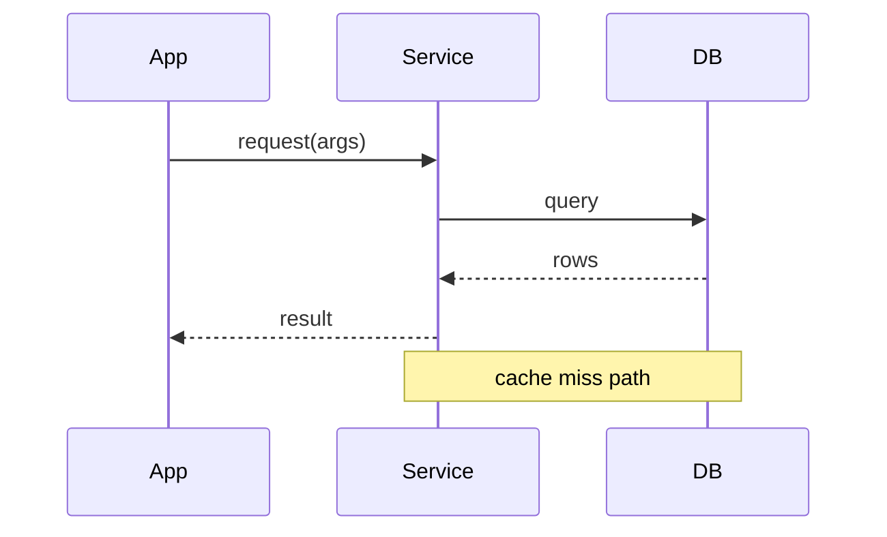
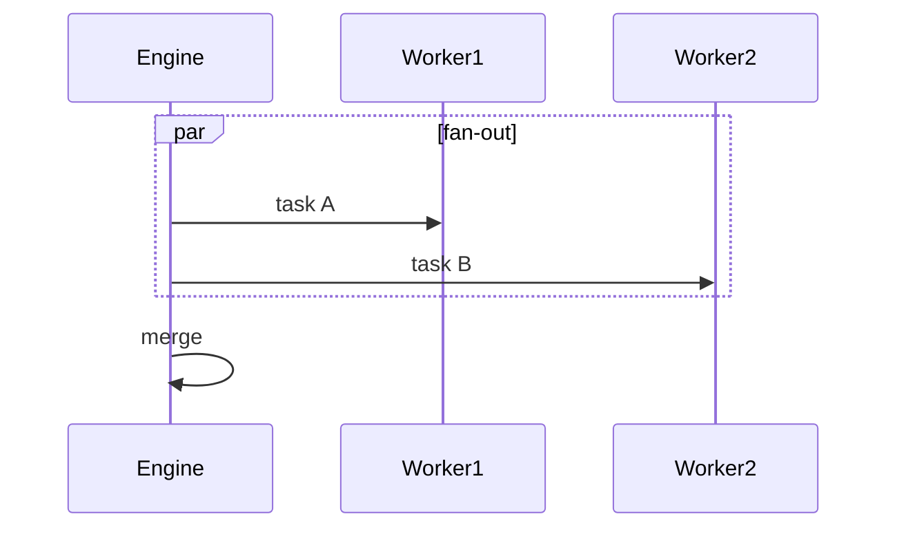
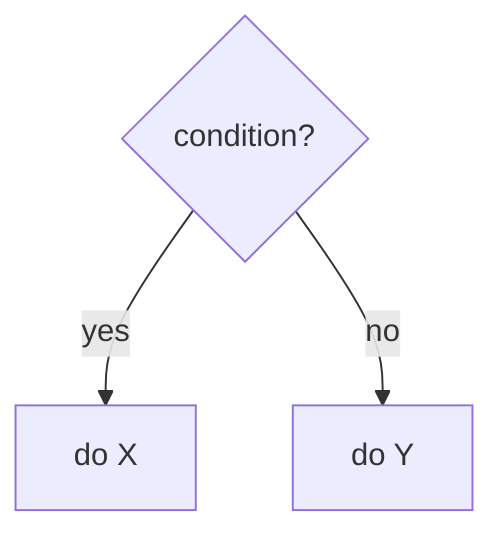
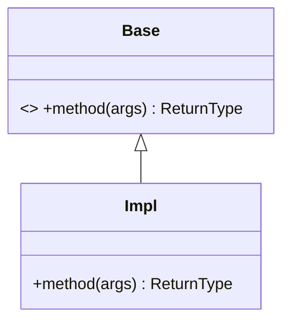
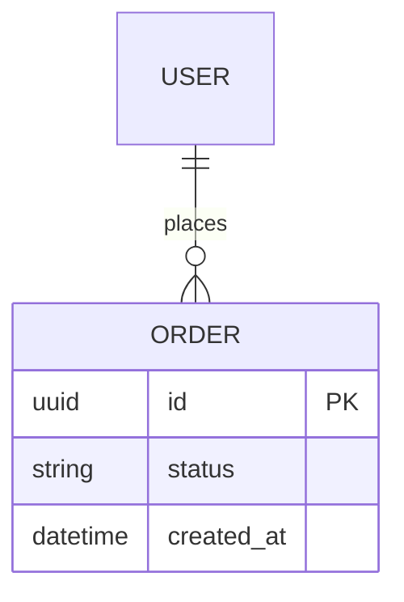
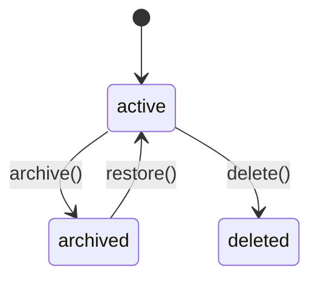

# Diagram & Graphics Cookbook

How to make the book *visual*. Two tools: **Mermaid** (for standard diagrams) and **`graphic`
blocks** (raw HTML/SVG, for everything Mermaid can't do). Both render to inline SVG/HTML and appear
in PDF, EPUB, and HTML.

---

## 1. Mermaid blocks

Use a fenced block with language `mermaid`. Keep each diagram to one idea.

### Layered architecture (flowchart with subgraphs)

````markdown

````

### Sequence diagram (a request flow — great for write/read paths)

````markdown

````

### Parallel work (`par`) and decisions

````markdown

````

````markdown

````

### Class diagram (interfaces / data shapes)

````markdown

````

### ER diagram (data model)

````markdown

````

### State machine

````markdown

````

### Mermaid tips

- **Quote labels** with punctuation/`()`/`/`: `A["foo(bar) / baz"]`. Use `<br/>` for line breaks.
- Highlight the key node: `style NodeId fill:#1a3b2a,color:#fff`. Pick colors that read on the
  chosen theme (on `dark`, prefer light fills/`color:#fff`).
- `flowchart TB` (top-bottom) prints better in a portrait book than `LR` for wide graphs; use `LR`
  for short pipelines.
- Keep node counts modest (≤ ~12). Split a busy diagram into two.
- Avoid exotic syntax (timeline, gitGraph, mindmap) unless needed — the common types above are the
  most robust across Mermaid versions.

---

## 2. `graphic` blocks — custom HTML/SVG

When Mermaid is the wrong tool (annotated callouts, comparison panels, legends, custom SVG,
"anatomy of X" labels), use a fenced block with language `graphic`. Its contents are passed through
as raw HTML and wrapped in a styled `<figure class="graphic">`. It inherits the theme's fonts/colors
via CSS variables, so prefer `var(--accent)`, `var(--ink)`, `var(--muted)`, `var(--line)`.

### Comparison panel (two approaches side by side)

````markdown
```graphic
<div style="display:flex;gap:14px;text-align:left">
  <div style="flex:1;border:1px solid var(--line);border-radius:8px;padding:12px">
    <div style="font-weight:700;color:var(--accent)">Approach A</div>
    <ul style="margin:.4em 0 0;padding-left:1.1em;font-size:9.5pt">
      <li>pro: simple</li><li>con: slow</li>
    </ul>
  </div>
  <div style="flex:1;border:1px solid var(--line);border-radius:8px;padding:12px">
    <div style="font-weight:700;color:var(--accent)">Approach B</div>
    <ul style="margin:.4em 0 0;padding-left:1.1em;font-size:9.5pt">
      <li>pro: fast</li><li>con: complex</li>
    </ul>
  </div>
</div>
<figcaption>A vs B at a glance.</figcaption>
```
````

### Callout / key-insight card

````markdown
```graphic
<div style="border-left:4px solid var(--accent);background:var(--quote-bg);
            padding:10px 14px;text-align:left">
  <strong>Key insight.</strong> One LLM call, deterministic dedup, links instead of merges.
</div>
```
````

### Custom labeled SVG ("anatomy of" a record/packet/formula)

Hand-authored SVG gives pixel control Mermaid can't. Always set `xmlns` and a `viewBox`.

````markdown
```graphic
<svg xmlns="http://www.w3.org/2000/svg" viewBox="0 0 520 120" width="100%" style="max-width:520px">
  <style>
    .box{fill:#fff;stroke:#888;rx:4} .k{fill:#5b3fa8;font:600 12px sans-serif}
    .v{fill:#222;font:12px monospace} .lab{fill:#777;font:10px sans-serif}
  </style>
  <rect class="box" x="2"  y="30" width="120" height="34"/>
  <rect class="box" x="122" y="30" width="160" height="34"/>
  <rect class="box" x="282" y="30" width="120" height="34"/>
  <text class="k" x="14"  y="52">id (uuid)</text>
  <text class="k" x="134" y="52">data (text)</text>
  <text class="k" x="294" y="52">hash (md5)</text>
  <text class="lab" x="14"  y="80">primary key</text>
  <text class="lab" x="134" y="80">the fact</text>
  <text class="lab" x="294" y="80">dedup</text>
</svg>
<figcaption>Anatomy of a stored record.</figcaption>
```
````

### Pipeline / numbered-stages strip

````markdown
```graphic
<div style="display:flex;align-items:stretch;gap:6px;font-family:sans-serif;font-size:9pt">
  <div style="flex:1;background:var(--th-bg);border-radius:6px;padding:8px;text-align:center">
    <div style="font-weight:800;color:var(--accent)">1</div>Extract</div>
  <div style="align-self:center">→</div>
  <div style="flex:1;background:var(--th-bg);border-radius:6px;padding:8px;text-align:center">
    <div style="font-weight:800;color:var(--accent)">2</div>Embed</div>
  <div style="align-self:center">→</div>
  <div style="flex:1;background:var(--th-bg);border-radius:6px;padding:8px;text-align:center">
    <div style="font-weight:800;color:var(--accent)">3</div>Persist</div>
</div>
```
````

### `graphic`-block rules

- **Keep it print-safe**: fixed/relative sizes, `max-width:100%`, no scripts, no external images
  (use inline SVG or CSS only — external URLs may not resolve in EPUB/offline PDF).
- **Use theme variables** so the graphic matches the chosen theme and stays legible on `dark`.
- **Well-formed markup**: the EPUB step lightly self-closes void tags, but write clean HTML
  (close every tag) so it survives XHTML conversion.
- Add a `<figcaption>…</figcaption>` for a caption (styled automatically).

---

## 3. When to use which

| Need | Use |
|------|-----|
| Boxes-and-arrows architecture | Mermaid `flowchart` |
| A request / data flow over time | Mermaid `sequenceDiagram` |
| Interfaces, inheritance, data shapes | Mermaid `classDiagram` |
| Tables / relations | Mermaid `erDiagram` |
| Lifecycle / status transitions | Mermaid `stateDiagram-v2` |
| Side-by-side comparison, callouts, legends | `graphic` (HTML) |
| Precise custom illustration, labeled "anatomy" | `graphic` (inline SVG) |
| Enumerations, cheat sheets, trade-off lists | plain Markdown tables |

Rule of thumb: **Mermaid for structure, `graphic` for emphasis and bespoke visuals, tables for
dense facts.** Mix all three across a chapter.
